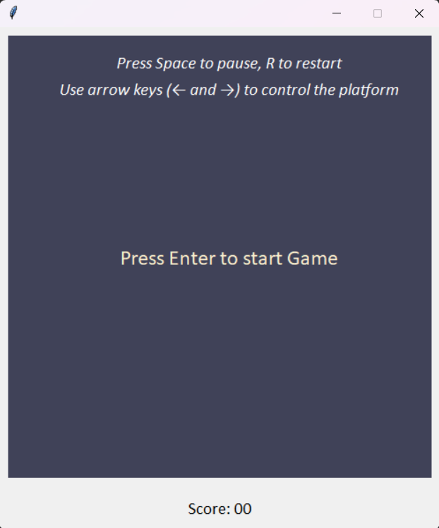
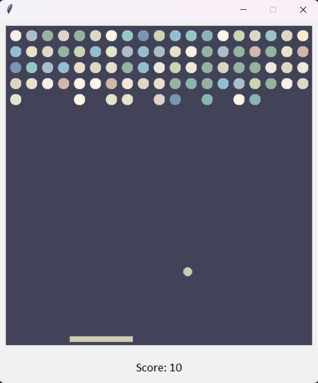

# Кружочки

Приветствую вас в моем проекте "Кружочки"! Это небольшая игра, созданная с использованием библиотеки Tkinter в Python. В этой игре вы контролируете платформу, отбивая мяч и разбивая круглые камни, чтобы набрать максимальное количество очков.

## Как играть

- Нажмите "Enter", чтобы начать игру.
- Используйте стрелки "←" и "→", чтобы перемещать платформу влево и вправо.
- Нажмите "R" для перезапуска игры.
- Во время игры нажмите "Пробел", чтобы поставить игру на паузу.

Ваша цель - разбить все камни и набрать максимальное количество очков. Остерегайтесь, чтобы мяч не упал вниз за пределы платформы!

## Установка

1. Убедитесь, что у вас установлен Python.
2. Скачайте репозиторий или склонируйте его на свой компьютер.
3. Запустите `main.py` для начала игры.
